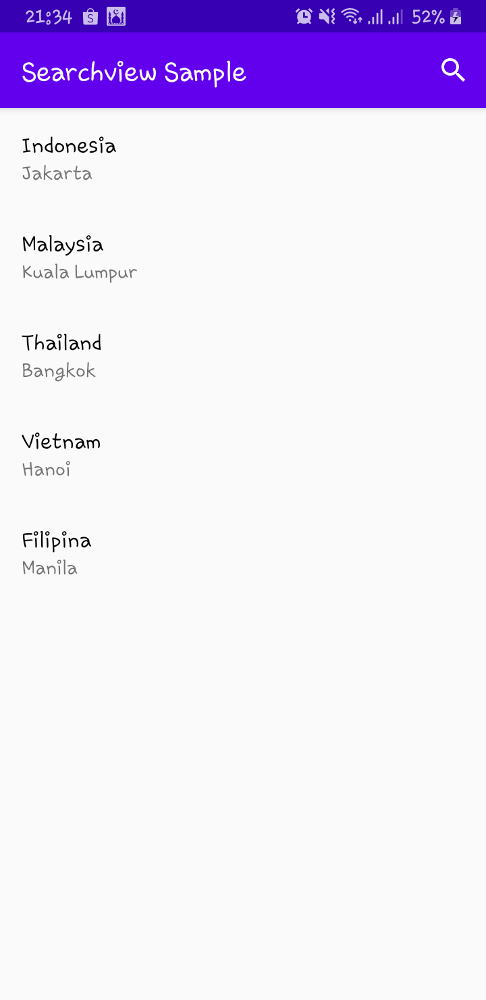
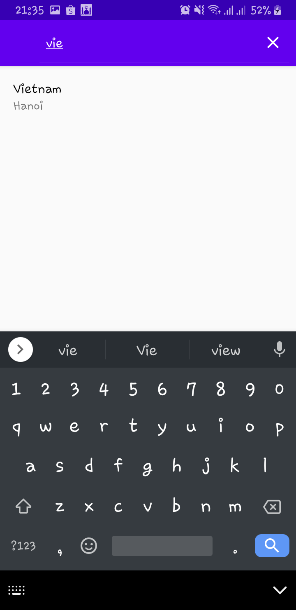

# Reusable Recyclerview Adapter
An Android libs for recyclerview adapter including support filterable data for searchview or material search bar. So you don't need to create class adapter if want to use recyclerview.
<br><br>*Sebuah library Android untuk adapter recyclerview termasuk mendukung filterable data untuk penggunaan searchview atau material search bar. Jadi anda tidak perlu membuat class adapter jika ingin menggunakan recyclerview.*

## Support 
Support from Android 4.4 KitKat / Minimum API 19
<br>*Dukungan mulai Android versi 4.4 KitKat / Minimal API 19*

## Installing 
Add repository in build.gradle
<br>*Tambahkan repository di build.gradle*
```gradle
allprojects {
    repositories {
        ...
        maven { url "https://jitpack.io" }
    }
}
```
And add dependencies
<br>*Dan tambahkan dependencies*
```gradle
dependencies {
    implementation 'androidx.recyclerview:recyclerview:1.1.0'
    implementation 'com.github.azmirizkifar20:reusable-recyclerview-adapter:1.0.3'
}
```

## How to use
### First Setup adapterCallback first
```MainActivity.kt
val adapterCallback = object : AdapterCallback<Model> {
    override fun initComponent(itemView: View, data: Negara, itemIndex: Int) {
        // init component here
    }

    override fun onItemClicked(itemView: View, data: Negara, itemIndex: Int) {
        // add logic here
    }
}
```

### Then setup reusable-adapter
```MainActivity.kt
// setup adapter
ReusableAdapter<Model>(this)
    .adapterCallback(adapterCallback)
    .setLayout(R.layout.example_layout)
    .isVerticalView(true)
    .addData(listData)
    .build(recyclerview)
```

### Component of reusable-adapter
```ReusableAdapter.kt
// #1 create reusable-adapter
ReusableAdapter<Model>(context: Context)

// #2 adapter callback (required)
adapterCallback(adapterCallback: AdapterCallback<Model>) 

// #3 set layout of recyclerview (required)
setLayout(layout: Int)

// #4 set orientation view (required) [choose one]
isVerticalView(isVertical: Boolean)
isHorizontalView(isHorizontal: Boolean)

// #5 add list of data (required)
addData(listData: List<Model>)

// #6 update data for realtime change (optional)
updateData(data: Model)

// #7 filterable for searchview (optional)
filterable()

// #8 the last and required component
build(recyclerView: RecyclerView)
```

## Sample code
### #1 Create xml item (item_negara.xml)
```item_negara.xml
<?xml version="1.0" encoding="utf-8"?>
<LinearLayout xmlns:android="http://schemas.android.com/apk/res/android"
    android:layout_width="match_parent"
    android:layout_height="wrap_content"
    android:padding="16dp"
    android:orientation="vertical">

    <TextView
        android:id="@+id/tv_nama_negara"
        android:layout_width="wrap_content"
        android:layout_height="wrap_content"
        android:text="Nama negara"
        android:textColor="@android:color/black"
        android:textSize="18sp" />

    <TextView
        android:id="@+id/tv_ibukota"
        android:layout_width="wrap_content"
        android:layout_height="wrap_content"
        android:text="Ibukota"
        android:textSize="16sp" />

</LinearLayout>
```

### #2 Create xml view on activity_main.xml
```activity_main.xml
<androidx.recyclerview.widget.RecyclerView
    android:id="@+id/rv_negara"
    android:layout_width="match_parent"
    android:layout_height="match_parent"
    tools:listitem="@layout/item_negara" />
```

### #3 Create data class
```Negara.kt
data class Negara (
    val nama_negara: String,
    val ibukota: String
)
```

### #4 Create list
```MainActivity.kt
val listNegara = listOf(
    Negara("Indonesia", "jakarta"),
    Negara("Malaysia", "Kuala Lumpur"),
    Negara("Thailand", "Bangkok"),
    Negara("Vietnam", "Hanoi"),
    Negara("Filipina", "Manila")
)
```

### #5 Setup adapter callback
```MainActivity.kt
// create adapter callback for init component
val adapterCallback = object : AdapterCallback<Negara> {
    override fun initComponent(itemView: View, data: Negara, itemIndex: Int) {
        itemView.tv_nama_negara.text = data.nama_negara
        itemView.tv_ibukota.text = data.ibukota
    }

    override fun onItemClicked(itemView: View, data: Negara, itemIndex: Int) {
        Toast.makeText(this@MainActivity, data.nama_negara, Toast.LENGTH_SHORT).show()
    }
}
```

### #6 setup reusable-adapter
```MainActivity.kt
// setup adapter
ReusableAdapter<Negara>(this)
    .adapterCallback(adapterCallback)
    .setLayout(R.layout.item_negara)
    .isVerticalView(true)
    .addData(listNegara)
    .build(rv_negara)
```

## Full sample code
1. [Reusable adapter](https://github.com/azmirizkifar20/reusable-recyclerview-adapter/blob/master/app/src/main/java/org/marproject/reusablerecyclerviewadapter/sample/noadapter/MainActivity.kt) <br>
2. [Reusable adapter with searchView](https://github.com/azmirizkifar20/reusable-recyclerview-adapter/blob/master/app/src/main/java/org/marproject/reusablerecyclerviewadapter/sample/searchview/MainActivity.kt) <br>
3. [Full sample code & project](https://github.com/azmirizkifar20/reusable-adapter-sample)

## searchview screenshot
<span align="center"></span>
<span align="center"></span>

## Show your support
Give a star and fork if this project helped you!